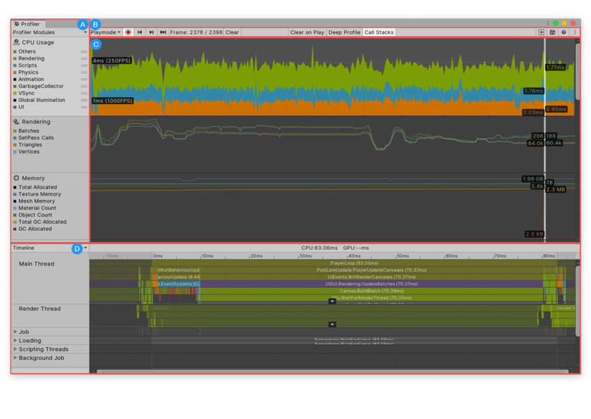

# Lab - Debugging & Profiling - Introduction to Profiling in Unity
*In this we will use the Unity Profiler to examine a game prototype via instrumentation profiling, to better understand where the game is spending it's resources to run, and whether it fits into our frame budget.*

### Core Concept: Profiling
Profiling is the process of analyzing various aspects of a game's performance to identify bottlenecks, inefficiencies, or areas for optimization. This is crucial for ensuring that the game runs smoothly and efficiently on target platforms, whether it's a PC, console, or mobile device.

The Unity Profiler allows developers to analyze and optimize the performance of their games. It provides detailed insights into various performance metrics such as CPU usage, GPU usage, memory usage, rendering times, and more.

Profiling is essential for targeting multiple platforms, including PC, consoles, and mobile devices, each with different hardware capabilities and limitations.

Based on the insights gained from profiling, developers optimize their game by identifying and addressing performance bottlenecks.
Profiling is an iterative process, with developers making adjustments and re-profiling their game until desired performance targets are met.

Unity Profiler Features:
- CPU Profiling: Analyzes CPU usage, including time spent on scripts, physics calculations, and other tasks.
- GPU Profiling: Provides insights into GPU usage, including rendering times, draw calls, and shader performance.
- Memory Profiling: Monitors memory usage, including heap memory, texture memory, and audio memory.
- Frame Debugger: Allows developers to step through each frame of rendering to identify rendering issues or unnecessary draw calls.
- Deep Profiling: Provides detailed information about each frame's execution, helping identify specific functions or scripts causing performance issues.
- Custom Profiling Markers: Developers can add custom profiling markers in their code to track the performance of specific sections or functions.
- Real-time Analysis: Profiler data is displayed in real-time, allowing developers to monitor performance while the game is running.

### Documentation

* [Unity Docs - The Profiler Window](https://docs.unity3d.com/Manual/ProfilerWindow.html)
* [Unity Docs - Profiler Overview](https://docs.unity3d.com/Manual/Profiler.html)
* [Unity "Unite Now" 2020 - Introduction to Profiling - YouTube 53:11](https://www.youtube.com/watch?v=uXRURWwabF4&t=311s)

## Goals for this Lab
1. Download and run a Unity project from a GitHub Repo
2. Use the Unity Profiler within the editor to record data during gameplay
3. Use the Frame Debugger to find inefficient draw calls

## Section 1 - Download and run a Unity project from a GitHub Repo
1. The lab game for this project has been uploaded to GitHub. Make a local clone of the Repo so that you can begin working on the project:

https://github.com/robblofield/Lab---Debugging-And-Profiling---Introduction-To-The-Unity-Profiler.git

2. Play the game and get a feel for how it performs on your computer. In an ideal world we would profile using a build of the game, not within the editor, but for this introduction we will work in the editor for profiling.
  
## Section 2 - Use the Unity Profiler within the editor to record data during gameplay

**1. Opening the Profiler:**

   - Navigate to the top menu bar in Unity.
   - Click on "Window" > "Analysis" > "Profiler" or use the shortcut Ctrl + 7 (Cmd + 7 on Mac) to open the Unity Profiler window.

**2. Setting Profiler Mode to Deep:**

   - In the Profiler window, select "Deep" mode from the top bar. This mode allows you to see detailed information about custom method calls in your project, not just Start() and Update().

**3. Recording Data and Playing the Game:**

   - Make sure your game scene is open and ready to play.
   - Click on the "Record" button in the Profiler window toolbar to start recording data.
   - Play your game for around 5 seconds to gather performance data.

**4. Understanding the Profiler Interface:**

- A: Profiler modules. This is a list of all the modules you can profile in your application. Use the drop-down menu at the top of this area to add and remove modules from the window.
- B: Profiler controls. Use these controls to set which device to profile from and what kind of profiling Unity should perform, navigate between frames, and start recording data.
- C: Frame charts. This area contains charts of each module the Profiler profiles. This area is blank when you open the Profiler for the first time, and fills with information when you start profiling your application.
- D: Module details panel. The information in this area of the window changes based on the module you have selected. For instance, when you select the CPU Usage Profiler module, it contains a detailed timeline and the option to switch to a Hierarchy view. When you select the Rendering Profiler module, this area displays a list of debugging information. This area is blank when you open the Profiler for the first time, and fills with information when you start profiling your application.

**5. Identifying Tasks Taking the Longest Time:**

Looking at the graphs and timeline you should be able to see how the frame of gameplay is being broken up into many smaller tasks, and you should also be able to see how long each of these tasks is taking to complete.

For a better understanding of these graphs, watching the Unity "Unit Now" 2020 talk on profiling linked in the documentation section of this lab is strongly recommended.

If you are outside of your frame budget, your project will either be CPU bound or GPU bound. This means that the frame is either waiting on your code to finish calculations on the CPU and therefore the GPU has to wait to begin its work, Or your CPU finishes it's tasks quickly but the GPU takes longer than expected to finish rendering the frame. It should be fairly easy to see in the timeline which situation you have as you will see a task named Gfx.WaitForPresent if GPU bound.

 Where CPU or GPU bound, this metric is the limiting factor of your game and is likely the first area you should target for optimisation. 

## Section 3 - Use the Frame Debugger to find inefficient draw calls
We can use the frame debugger alongside the profiler to see every step the GPU takes in rendering the frame. This can be helpful to see if we are being ineficient at the rendering stage. For example, we might be rendering mesh in the background the scene, that is later covered up by foreground elements. The step by step functionality of the frame debugger allows us to identify these aspects which would otherwise not be possible.

1. Let's try to break the lab game, shoot around 50 arrows onto the floor whilst recording profiler data, and then look at the pile of arrows and pause the gameplay

2. Open the frame Debugger from: Window > Analysis > Frame Debugger and then press "enable" to load in the frame data
*Note that the Frame Debugger only allows you to look at a single frame at a time*

3. You can click through each event on the left hand side, or you can use the scrubber at the top of the window to go through the stack

4. The arrows are being made as individual draw calls, this means that the more arrows you have onscreen the higher number of calls you will have, and the longer the GPU will be busy

5. When you have a high number of instances in the scene together, it is always best to minimise their impact during rendering. There are a lot of optimisation methods at play here:
**Optimising the Asset:**
- You could optimise the arrow mesh (e.g lower the poly count from 40k triangles to something sensible)
- You could optimise the textures (e.g use a small single texture with baked lighting for the metalic matierials etc - not 4x 4k PBR textures)
**Optimising the Render Pipeline:**
- You can make sure that the shader for the arrow is allowed to run via GPU instancing
- You can make sure that you are using "SRP batching" if using either the URP or HDRP in Unity
  
In this case all 4 of these will help to improve performance:
- The arrow is significantly over poly count budget
- The textures are very high res and could easily be a single base colour, not a PBR material
- The project is using URP, but does not have SRP Batching enabled
- The material does not have GPU instancing enabled

The last two are the most important change to make, as GPU instancing and SRP Batching allow these models to be rendered in 1 or 2 draw calls, not 50.

6. Research in the Unity Documentation how to enable SRP Batching and GPU instancing. Implement them and then test again.
  

## Summary
In this lab we have looked at some of the advanced debugging tools available in Unity, and worked with them on a surface level to find out information about how our game is running and completing each frame.

In future you should plan set milestones to work through profiling your game and testing for performance. Where possible, you should profile on a build of the game on your targeted hardware. Additionally, you should make comprehensive notes about your game performance and frame rates etc during these sessions so that you can compare results before and after optimisations.

